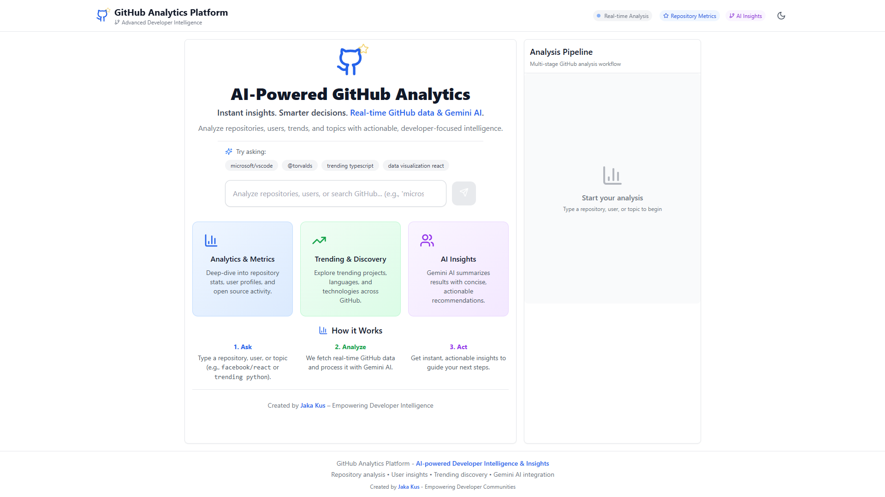
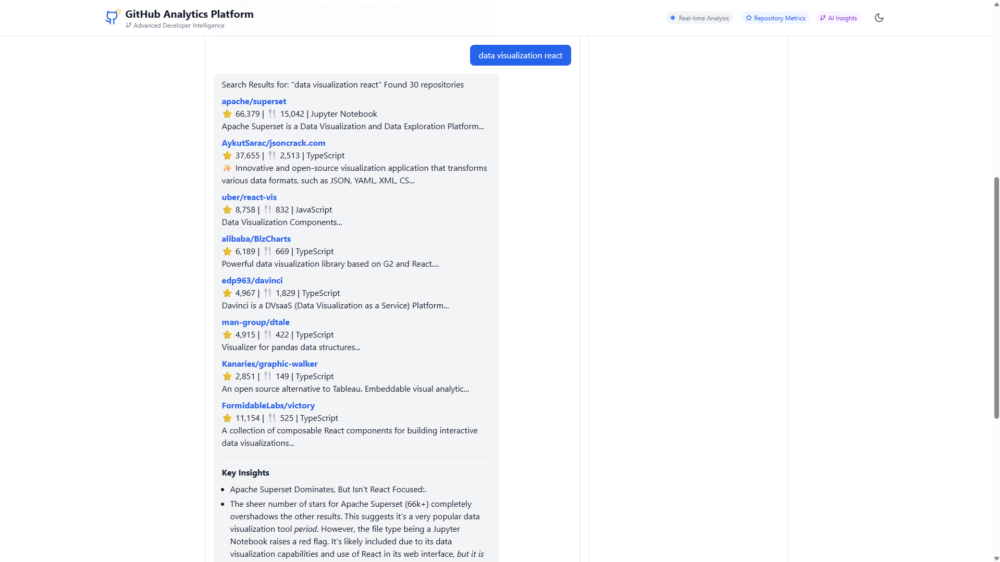
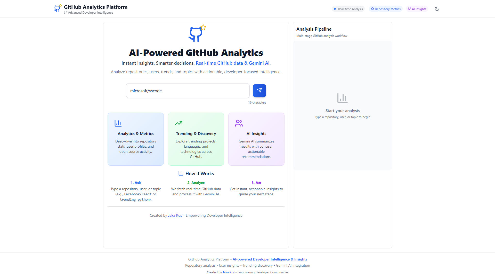
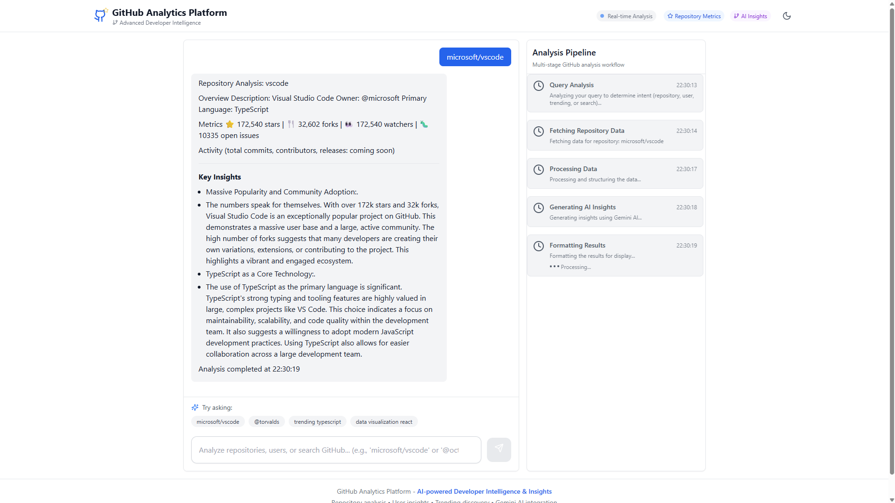

# GitHub Analytics Platform

A modern, AI-powered analytics platform for GitHub repositories, users, trending projects, and custom searches. Built with React, TypeScript, Vite, and Gemini AI for actionable developer insights.

---

## 🚀 Features
- **Repository Analysis:** Get detailed metrics and AI-generated insights for any public GitHub repository.
- **User Analysis:** Analyze developer profiles, contributions, and influence.
- **Trending Repositories:** Discover trending projects by language or topic.
- **Search:** Find and analyze repositories by keyword or technology.
- **Gemini AI Integration:** Summarizes and explains results with concise, actionable insights.
- **Modern UI/UX:** Clean, responsive, and user-friendly interface with instant onboarding.

---

## 🖼️ Preview


## 🖼️ App Walkthrough

### Welcome & Onboarding

Start with a clean, modern onboarding screen. Instantly search for any GitHub repository, user, or trending topic using the AI-powered search bar. The platform highlights its core features: repository analytics, trending discovery, and Gemini AI insights.

### Discovering Data Visualization Projects

Search for trending or popular repositories by keyword or technology. Here, the user searches for "data visualization react" and receives a curated list of top repositories, including stars, language, and concise descriptions.

### Repository Search: Visual Studio Code

Analyze any public GitHub repository by name. The app fetches real-time data and prepares a detailed analysis pipeline for the selected project.

### AI-Powered Repository Analysis

Get actionable, AI-generated insights for any repository. The platform summarizes key metrics, community trends, and technology choices using Gemini AI, helping developers and teams make smarter decisions.

---

## 🛠️ Getting Started

### 1. Clone the Repository
```sh
git clone https://github.com/Jakakus/github-analytics-platform.git
cd github-analytics-platform
```

### 2. Install Dependencies
```sh
npm install
```

### 3. Set Up Environment Variables
Create a `.env` file in the project root with the following:
```env
VITE_GITHUB_TOKEN=your_github_token
VITE_GEMINI_API_KEY=your_gemini_api_key
VITE_GEMINI_API_URL=your_gemini_api_url
```

### 4. Run Locally
```sh
npm run dev
```
The app will be available at [http://localhost:5173](http://localhost:5173) (or as shown in your terminal).

---

## 🌐 Deployment (Vercel)
1. **Push your code to GitHub** (see below for instructions).
2. **Import the repo into [Vercel](https://vercel.com/)** and connect your environment variables.
3. **Build settings:**
   - Framework: Vite
   - Build Command: `vite build`
   - Output Directory: `dist`

---

## 📦 Creating a New GitHub Repository & Pushing Code
```sh
git init
git add .
git commit -m "Initial commit"
git branch -M main
git remote add origin https://github.com/Jakakus/github-analytics-platform.git
git push -u origin main
```

---

## 📄 License
MIT

---

**Created by Jaka Kus**

## 🙏 Acknowledgments
- **Google Gemini AI** for advanced analytics capabilities
- **React Team** for the excellent frontend framework
- **Tailwind CSS** for the utility-first CSS framework
- **Lucide** for beautiful, consistent icons 